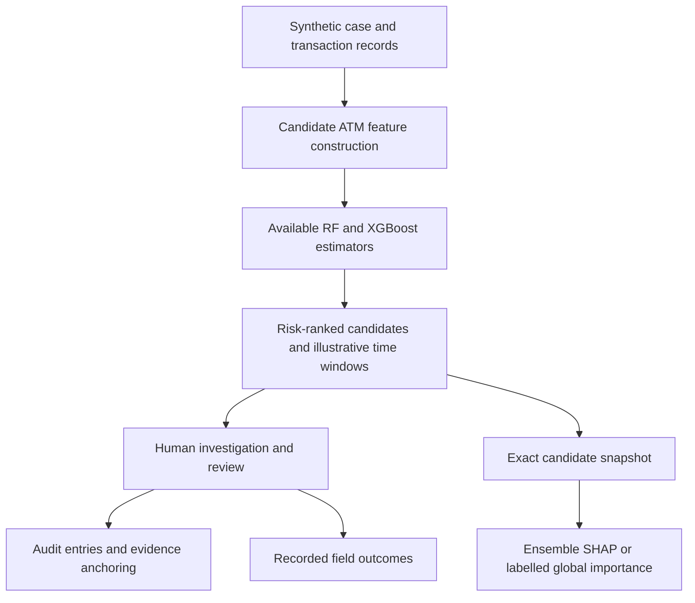

# ATLAS — Advanced Threat Location & Alert System

## Smart India Hackathon 2026 | Problem Statement PS-26184

This identifier is the project's stated submission target; this repository does not independently verify official SIH eligibility or problem-statement requirements.

## Executive summary

ATLAS is an **ML-assisted investigation-console prototype** for demonstrating synthetic cash-out risk ranking, geospatial triage, human review, and tamper-evident evidence handling. It is not connected to banking, government, or operational crime databases.

The trained binary classifier and application workflow are implemented. Effective prediction of the actual next ATM or future cash-out time is **not established**. Current synthetic holdout metrics (retrained 2026-10-10, `rf-xgb-synthetic-v6-20261010`) are reported in `backend/model/validation_report.json`; older legacy performance claims stay withdrawn.

## Problem and proposed workflow

The prototype explores how an investigator might prioritize locations when funds move through linked accounts. It demonstrates a hypothetical workflow, not measured incident-response timings or verified superiority over existing government/bank systems.



## Implemented architecture

| Layer | Current implementation |
| --- | --- |
| Frontend | React 18, strict TypeScript, Vite 8, React Router 7, Leaflet, Recharts, reusable components and lazy visualization routes |
| API | FastAPI; authenticated case, prediction, alert, review, audit, evidence, model, and health endpoints |
| Database | SQLAlchemy; explicit PostgreSQL/SQLite configuration, frozen baseline migration followed by revisions 0001–0003 |
| ML | Random Forest/XGBoost binary classification; synthetic training generator and provenance-bound revalidation |
| Explanations | Exact saved candidate inputs and model identity; ensemble Kernel SHAP with empirical training background, or explicitly non-local importance |
| Evidence | SHA-256-linked local ledger, Merkle proofs, prototype PoW mining and in-process network simulation |
| Notifications | Tracked queued SMS/email jobs with optional configured providers; delivery is not implied by enqueueing. Every HIGH (>70) prediction raises an on-screen toast + siren (mutable, browser-generated) and enqueues a Fast2SMS message to `INVESTIGATOR_PHONE_NUMBER` (trial key for testing; production needs DLT registration). Alert rows dedupe to one open alert per case+ATM and predictions never write audit entries |
| Spatial | Synthetic city/ATM registry, haversine calculations, optional PostGIS integration |

### Two distinct console modes

**`/demo`** is a public, backend-independent console. It uses bundled city-specific synthetic fixtures, local acknowledgement/resolution, and no API or backend WebSocket calls. Backend-only tools are visibly disabled. Not every case has a detailed bundled prediction; missing fixtures are disclosed rather than invented. Map tiles/fonts may require external internet.

**`/real`** is the authenticated API-backed console. The name does not imply real-world data. It gates initial loading, fetches the explicitly selected case, restores city overview when the city changes, and never substitutes bundled synthetic predictions for failed API responses. Missing models/ATM data return explicit errors.

## Security boundaries

- `backend/security_config.py` is the shared source of signing and encryption settings. Outside explicit demo/test mode, missing/default signing keys are rejected, access/refresh secrets must differ, and the encryption secret must be a non-default 64-character hex key.
- `SECRET_KEY` and `JWT_SECRET_KEY` are aliases; if both are configured they must agree.
- Password storage is **bcrypt**. PBKDF2 derives the AES key; it is not the password hashing algorithm.
- Refresh tokens use HttpOnly cookies with rotation/revocation. Access tokens remain in browser local storage, so XSS protection remains important.
- Centralized department/case visibility and action-specific permissions apply to case-owned reads and writes. Self-service department changes are blocked. Review/evidence actors come from the authenticated identity.
- AES-256-GCM protects sensitive ORM writes through bind/result conversion and seals evidence previews. Legacy plaintext and existing ciphertext remain readable. This does not encrypt every database column, raw SQL tool, or external export.
- Existing plaintext data has **not** been backfilled. Encryption-key rotation needs a planned migration and backups.
- Static-file paths are resolved and checked for containment. Traversal, absolute paths, and escaping symlinks are rejected.
- CSRF handling, selected route limits, auth-IP limits, WebSocket caps, CSP, explicit CORS and security headers are implemented. Demo mode relaxes controls and must not host sensitive data.
- HTTPS requires both `SSL_CERTFILE` and `SSL_KEYFILE` or an authorised reverse proxy. HSTS alone does not provide TLS.

These controls do not constitute an independent penetration test or production security certification.

## Prediction inputs and explanations

Candidate features include distance, synthetic crime-density/ATM attributes, observable evening-window fit, amount, linked-account count, hour/day, and derived proximity/velocity values. Some operational inputs are deterministic simulation heuristics, not observed financial evidence.

Each candidate's exact input vector, estimator output, version and model fingerprint is persisted in an encrypted snapshot envelope in `RankedLocation.reason`. The readable reason is returned separately. `/api/model/shap/{case_id}?atm_id=<id>` retrieves that snapshot and verifies model identity before explaining it.

Local SHAP explains the full available ensemble probability function. It uses saved empirical training rows, reports the true expected value, verifies additive reconstruction, and caches by model/background/input rather than case ID. Base value and contributions are in the units declared by the API; they must be scaled together.

Without empirical background, the UI shows **global feature importance**, not fabricated local SHAP. Legacy bundled artifacts have no validated empirical background, so genuine local SHAP requires explicit regeneration/retraining.

Risk index and confidence are uncalibrated model-derived scores—not the probability that an officer will find the criminal at the indicated ATM. Time windows are illustrative rules, not a fitted and validated event-time forecast. Historical-similarity descriptions and trends are labelled simulated.

## Evaluation protocol and limitations

### Corrected pipeline

`generate_data.py` maintains consistent fraud-ring ATM geography, explicit transaction/group IDs, and the same observable evening-window semantics used in serving. Synthetic `cash_out_occurred` is a sampled cash-out event; injected fraud membership is a separate attribute.

`train_model.py` fixes group/city/month exclusions **before fitting**. Related groups are kept out of training when they touch an excluded slice. It saves row/group IDs, ordered-content hashes, estimator hashes, and empirical training background. Synthetic month order does not become evidence of real chronological generalization.

`revalidate_model.py` checks this provenance against the dataset and estimator artifacts. It refuses to label mixed training/test slices as holdouts or an ordered first-20,000-row prefix as a random sample. Trapezoidal PR-AUC and average precision are identified separately. Row-level nearest-distance/historical-density benchmarks are not case-level dispatch validation.

### Current artifact status

Regenerated and retrained 2026-10-10 (`rf-xgb-synthetic-v6-20261010`): group holdout precision 87.3 / recall 33.7 / F1 48.7 / ROC-AUC 0.67 / PR-AUC 0.36, with matching time/location holdouts, 10-bin calibration and threshold sweeps in `model/validation_report.json`. Library versions are recorded in metadata; the XGBoost estimator is archived in native JSON as well as serving pickle. What remains unavailable by design: next-ATM Hit@K, geographic error, future-window coverage (need observed outcomes).

To explicitly replace generated data and weights after backing up anything needed:

```bash
cd backend
python generate_data.py
python train_model.py
python revalidate_model.py
```

### Measurements still needed

Define the actual task before claiming next-location/time effectiveness: given information available at complaint time, rank candidates for an observed cash-out within a specified future horizon. It needs case-grouped candidates, prediction-time cutoffs and observed outcomes.

Evaluate Hit@3/Hit@5, geographic error, future-window coverage, precision/recall and investigator alert workload against genuine per-case baselines. Select thresholds with a separate validation process; descriptive holdout sweeps do not establish a tuned operational threshold. No model improvement or real-world metric is guaranteed by correcting the evaluation.

NLP triage is a statistical TF-IDF + Naive Bayes classifier trained on illustrative templates (not transformer-based, not trained on real complaints). Mule graphs are built live from case transaction records with Louvain communities (illustrative records; account-count synthesis only as fallback). Drift/anomaly surfaces are heuristics, not validated population stability index or IsolationForest monitoring. Federated learning is not implemented.

## Setup and configuration

Use standard **CPython 3.13 x64** and **Node 22.12+**. See `README.md` and `backend/requirements.txt` for setup and dependency pins. The root `.env.example` is a configuration template, not a deployed secret file.

From `backend`, with Git Bash/POSIX environment syntax:

```bash
pip install -r requirements.txt
DEMO_MODE=true DATABASE_URL=sqlite:///./atlas-demo.db python start.py
```

For a clean setup check without starting a server:

```bash
DEMO_MODE=true DATABASE_URL=sqlite:///./atlas-clean-demo.db python start.py --setup-only
```

Explicit database URLs are respected. `start.py` applies migrations before optional demo seeding, retains existing data, and honors paired TLS settings. Non-demo mode does not seed public credentials. Provision authorised users separately.

From `frontend`:

```bash
npm ci
npm run dev
```

Open `/demo` for the local backup console. For `/real`, start the backend and log in; demo quick buttons require `VITE_DEMO_MODE=1` and backend demo mode. The README links to a demonstration video, not a hosted interactive deployment.

## Validation performed locally

| Check | Result |
| --- | --- |
| Full isolated backend suite | 237 passed, 2 skipped |
| Fresh Windows CPython 3.13 environment, pinned dependencies | Installation, `pip check`, SHAP import and estimator loading passed |
| Full suite in that fresh environment | 237 passed, 2 skipped |
| Frontend unit tests | 83 passed |
| Frontend lint and production build | Passed |
| Targeted Chromium browser tests | 4 passed, including isolated real-handler integration |
| Windows/Linux wheel resolution | Passed; Linux runtime not exercised |

Tests use temporary databases/ledgers and do not mutate the project database or dispatch notifications. Browser integration bridges real FastAPI handlers through TestClient; it does not verify deployed HTTP/WebSocket transport. Skips concern Windows symlink privilege and unconfigured PostgreSQL/PostGIS integration. XGBoost legacy serialization and framework deprecation warnings remain.

Commands are in the README. Counts describe this local validation, not a promise that CI has run on GitHub. No commits, pushes, or GitHub writes were performed.

## Demo strategy — one connected investigation

1. State the synthetic-data boundary and open a case in the API-backed console.
2. Show that selecting the case changes its ranked ATM candidates.
3. Select an ATM and show exact inputs; distinguish local SHAP from importance fallback.
4. Simulate a transaction and show the updated prediction. Do not promise a high-risk alert if the actual score is below threshold.
5. Acknowledge an available alert and demonstrate an authorised human review action.
6. Anchor synthetic evidence and verify its hash/linkage. Explain that nodes are local simulations.
7. Show the model card and explain why missing validation is unavailable rather than quoting historical accuracy.

If the backend fails, explicitly switch to `/demo` or the backup video. Do not imply that offline actions were recorded on the backend. Freeze a tested fixture/environment before the presentation.

## Prepared answers for judges

**Is this connected to a bank or government system?**

No. All records are authorised synthetic demonstration fixtures. External integrations are future work requiring approvals.

**How accurate is the next-ATM prediction?**

Not established. The implemented classifiers score synthetic rows (current holdout metrics in `backend/model/validation_report.json`); actual next-location/time metrics require case-grouped future outcomes. Older unsupported metrics stay withdrawn.

**What does the blockchain prove?**

It demonstrates local tamper detection through hashing, linkage and mining. In-process consensus is not independent government-network trust, legal admissibility, or immutable external storage.

**Are all fields encrypted?**

No. Selected sensitive ORM fields and evidence previews are encrypted on runtime writes. Legacy backfill, key rotation and every export/storage path require separate planning.

**Is this production-ready?**

No. PostgreSQL/PostGIS integration, deployed TLS/WebSockets, delivery/retry behavior, concurrent writers, penetration testing and authorised real-data validation remain separate requirements. The current goal is a reproducible synthetic investigation prototype.

## Submission boundary

Submit the integrated workflow and honest evidence, not feature-count or unvalidated accuracy claims. Real-world effectiveness, investigator usability and differentiation need independent assessment. The local improvements strengthen implementation correctness; they do not guarantee SIH selection.
